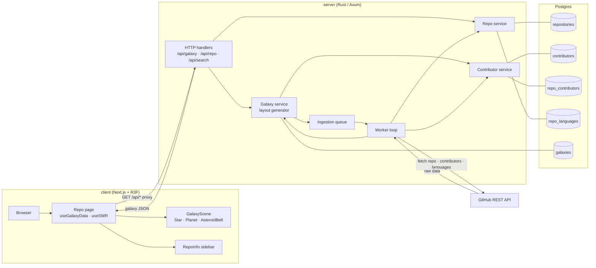
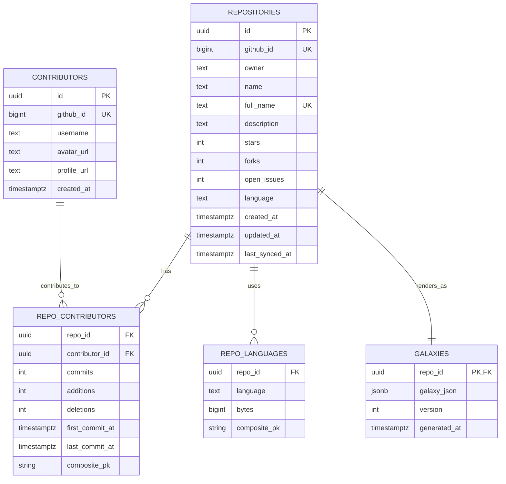

## Oxide

Oxide is a 3D visualization of GitHub repositories and their contributors, rendered as galaxies in space. Stars are repositories, planets are contributors, and an asteroid belt represents everyone beyond the top contributors.

This repo contains:

- `client/` – Three.js (or similar) frontend that renders galaxies.
- `server/` – Rust/Axum backend that talks to the GitHub API, stores data in Postgres, and generates deterministic galaxy layouts.

### How it works (short version)

- You ask the backend for a galaxy: `GET /api/galaxy/{owner}/{repo}`.
- The server:
  - Pulls repo + contributor + language data from the GitHub API.
  - Normalizes and stores it in Postgres.
  - Generates a deterministic layout:
    - Repo → central star.
    - Top 50 contributors → planets (log‑scaled sizes, rank‑based orbits, hashed positions).
    - Everyone else → `asteroid_belt.count` for the frontend to visualize densely without killing the GPU.
- The frontend turns that JSON into a 3D scene.

### Architecture



### Database ER diagram



### Running the backend

From `server/`:

```bash
cp .env.example .env
# edit .env and set a real GitHub token + DATABASE_URL
cargo run
```

Key endpoints (default base URL: `http://localhost:8080`):

- `GET /api/galaxy/{owner}/{repo}` – galaxy layout JSON (`star`, `planets`, `asteroid_belt`).
- `GET /api/repo/{owner}/{repo}` – cached repository metadata.
- `GET /api/search?q=query` – search GitHub repos, cached into Postgres.

### Tech stack

- **Language**: Rust (async)
- **Web**: Axum + Tokio
- **DB**: Postgres + SQLx migrations
- **HTTP client**: Reqwest (GitHub API)
- **Config**: `.env` via `dotenvy`
- **Logging**: `tracing`

The backend is intentionally lean: one binary, one worker loop, one Postgres schema. No distributed queue yet; if that ever changes, it should still feel like this README.

